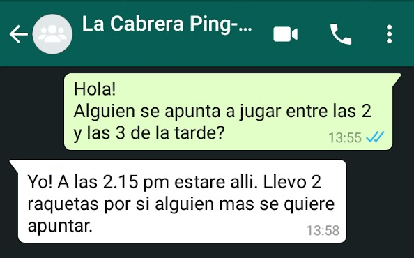

## Bienvenido!

[**Madrid juega al ping-pong**](http://tinyurl.com/madrid-ping-pong) es un proyecto personal que pretende:
- Dar a conocer la localización mesas de ping-pong públicas y gratuitas que hay en la ciudad de Madrid
- Facilitar el encuentro de personas interesadas en jugar

En principio eso es todo. Luego el tiempo dirá.

El ping-pong es un deporte sumamente divertido en el que uno puede mejorar muy rápido (en cuestión de minutos incluso) y en el que pueden jugar desde 2 hasta 6+ personas a la vez ([rueda](https://www.youtube.com/watch?v=2w0lYanJtzA)). Incluso sin raqueta!

----------------------------------------------------------------------

## Mapa de mesas (en desarrollo)

<iframe src="https://www.google.com/maps/d/embed?mid=1Fmxpo1Q1BcEdykBuxHHcZEdoVkncN8Zv" width="640" height="480"></iframe>

Pincha [aqui](https://www.google.com/maps/d/edit?mid=1Fmxpo1Q1BcEdykBuxHHcZEdoVkncN8Zv&usp=sharing) para abrirlo.

Puedes ver exactamente dónde está la mesa o grupo de mesas.

La mesa que tiene un grupo de whatsapp cambia de color a verde.

----------------------------------------------------------------------

## Quedar y jugar

Algunas de las mesas tiene un grupo de whatsapp. Cualquiera puede entrar y salir del grupo cuando lo desee.

La idea es que la persona interesada en jugar en una mesa/zona en particular se meta en ese grupo y proponga cuando quiera jugar. Como el lugar ya esta prefijado, solo hace falta acordar una hora.

He querido que la forma de contactar sea lo más directa y sencilla posible (no redes sociales) y puesto que la mayoría de las personas en España tienen Whatsapp pues eso usamos.

----------------------------------------------------------------------

## Se necesitan colaboradores

Para:
- Mapear las mesas: Poner las [mesas disponibles](https://docs.google.com/spreadsheets/d/e/2PACX-1vT56qFroA4dhKBhXHxo7w2GhUJ-4m2y1KrsB3aR5YwaqPmDNMHQis32A0b7CdG6CwAkO4m2DOB7DdIw/pubhtml?gid=755616272&single=true)* en el mapa y darles un nombre. 
- Crear grupos de Whatsapp (uno por mesa/zona). Esto en principio solo para la mesa que tu vayas a usar.

Si quieres colaborar [pincha aqui](https://mr-ruben.github.io/Madrid-juega-al-ping-pong/mapear.html) para enviarme la informacion sobre las mesas que quieras mapear.

Si lo deseas puedes contactarme por [whatsapp](https://wa.link/j7bt8j) o [email](http://tinyurl.com/yxhn7shc).

`*` Provienen de esta [web](https://datos.madrid.es/portal/site/egob/menuitem.c05c1f754a33a9fbe4b2e4b284f1a5a0/?vgnextoid=f978e9d0db722710VgnVCM2000001f4a900aRCRD&vgnextchannel=374512b9ace9f310VgnVCM100000171f5a0aRCRD&vgnextfmt=default)

Aprovecho para dar las gracias al Ayuntamiento de Madrid por poner mesas y decir dónde están.

----------------------------------------------------------------------

## Mesas mapeadas

<iframe width="95%" height="50%" src="https://docs.google.com/spreadsheets/d/e/2PACX-1vT56qFroA4dhKBhXHxo7w2GhUJ-4m2y1KrsB3aR5YwaqPmDNMHQis32A0b7CdG6CwAkO4m2DOB7DdIw/pubhtml?gid=755616272&amp;single=true&amp;widget=true&amp;headers=false"></iframe>

----------------------------------------------------------------------

## Log de eventos
2020-10-13 Creación de esta web [http://tinyurl.com/madrid-ping-pong](http://tinyurl.com/madrid-ping-pong) y el primer grupo de whatsapp (by me)

