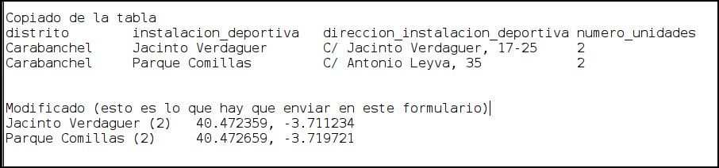

--- 
layout: page
title: "Mapeando mesas"
permalink: /mapear.html
---

## Mapeando mesas de ping-pong en Madrid

Gracias por su ayuda.

Madrid es grande, hay muchas mesas y no todas se ven desde el satélite, por eso necesito su ayuda para ponerlas en el mapa.

Lo único que necesito es las coordenadas de una mesa y el nombre que quiere que le de a la mesa o grupo de mesas. Tambien puede añadir cualquier comentario que considere util.

Aqui puede ver las que están mapeadas y las que no.

<iframe width="80%" height="40%" src="https://docs.google.com/spreadsheets/d/e/2PACX-1vT56qFroA4dhKBhXHxo7w2GhUJ-4m2y1KrsB3aR5YwaqPmDNMHQis32A0b7CdG6CwAkO4m2DOB7DdIw/pubhtml?gid=755616272&single=true&widget=true&headers=false"></iframe>

Si quiere copie las lineas que le interese mapear y substituya la dirección por las coordenadas geográficas.

### Como obtengo las coordenadas?

1. Abra Google Maps
2. Cambie a modo Satelite
3. Pinche sobre la mesa de ping-pong (+ de 1 segundo, hasta que salga el marcador).
4. Pinche en el link que aparece
5. Copie las coordenadas de ese punto.

Este mini video muestra esos pasos

Si alguna mesa/zona tiene un grupo de whatsapp, incluyalo también para que otros puedan conocerlo.

He aqui un ejemplo basico.

Pinche [aqui](https://forms.gle/CC6xKEq1w5Z2FXxP7) para enviarme la informacion recopilada.

Gracias!

